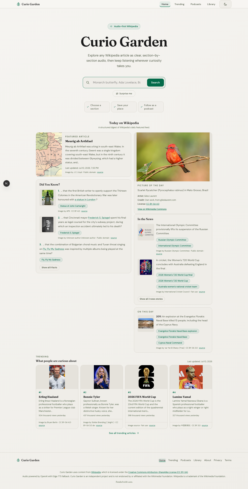
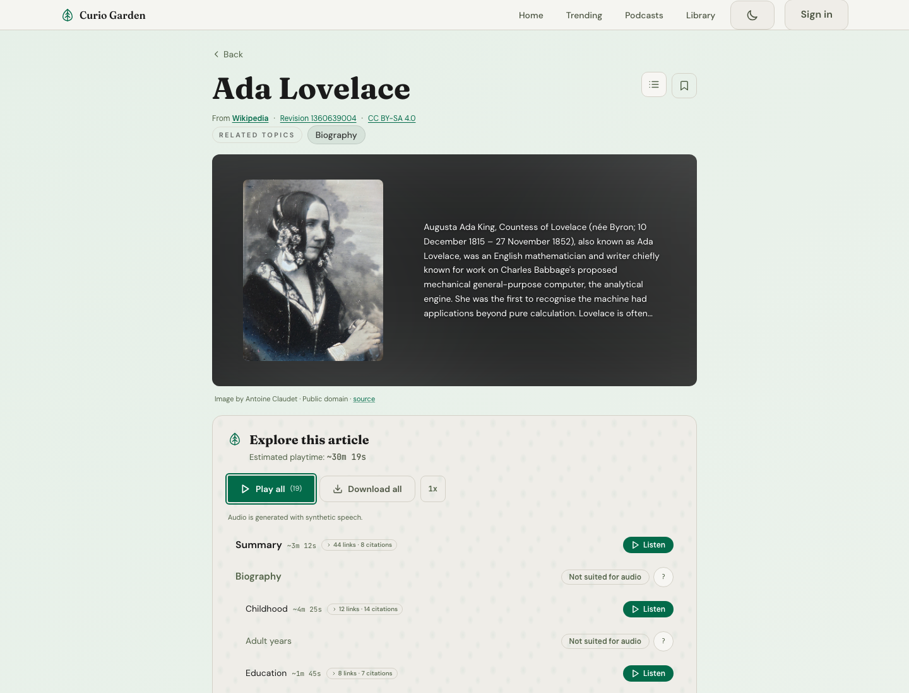
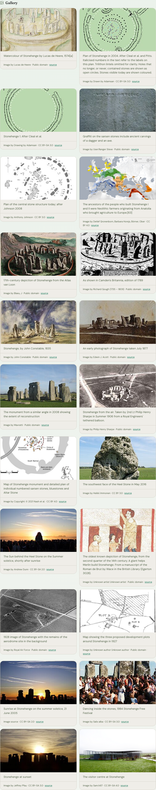

# Curio Garden


Your Wikipedia listening library and personal podcast queue — an accessibility-first web app that turns Wikipedia articles into structured, navigable audio you can listen to right in your browser or follow in your podcast app.

## Features

**Audio playback** — Listen to any Wikipedia article section by section. Play a single section, or hit Play All for the full lean-back experience with automatic progression. Adjustable speed from 0.5× to 3×, with your preference saved between sessions. Resume from where you left off when you return to an article. Download full articles as MP3 for offline listening.

**Audio** — Powered by OpenAI `gpt-4o-mini-tts` with Microsoft Edge TTS fallback. Generated synthetic speech is cached in Convex by provider, model, voice, prompt version, and normalization version so narration changes can regenerate cleanly without breaking existing audio.

**Podcasts** — Curio Garden publishes multiple RSS podcast feeds. The featured-article feed turns Wikipedia's featured article into a full listening session, the trending-brief feed turns the daily AI-generated trend briefing into a podcast episode with episode-specific collage artwork, and signed-in users get a private-by-token personal playlist feed that mirrors their dashboard queue.

**Discovery** — Search Wikipedia, browse today's Featured Article (with thumbnail), or tap "Surprise me" for a random article. A cron-cached "Today on Wikipedia" section gathers the full Did You Know list, editor-curated In the News items, an accessible Picture of the Day with cached spoken description audio, a small On This Day entry, and a compact Trending teaser. The dedicated Trending page keeps the full pageview-driven list and daily audio brief. NSFW category filtering keeps random and trending results safe. After finishing an article, related articles are surfaced as "Listen next" suggestions.

**Trending briefing** — The Trending page can generate a daily AI-written audio briefing that summarizes why those articles are spiking and links out to recent news sources. The brief text is generated once per trending date through the OpenAI Responses API with web search, converted to synthetic speech, and cached in Convex.

**Accessible article context** — Articles can add revision-matched maps, timelines, charts, and diagrams when Wikipedia's structured source supports them. Every visual has a useful text equivalent, descriptive caption, keyboard-operable controls, and downloadable source data where appropriate. Visual context stays out of article narration and the Play All queue.

**Article images** — Wikipedia thumbnails are displayed in article views with responsive layouts that adapt to portrait and landscape orientations. Images are prefetched for faster display. A Gallery section below the table of contents shows all images from the article with their captions in a card grid, with a keyboard-navigable lightbox for full-size viewing.

**Accounts and dashboard** — Clerk sign-in unlocks a dashboard with a synced library, a personal playlist queue, copyable RSS feed URLs, and queue management controls for moving, removing, and retrying generated episodes. Guests can still explore freely and keep a device-local library without creating an account.

**Your library** — Recently listened articles appear on the home page. Save articles to your reading list with one tap and find them on the Library page. Guests keep bookmarks on the current device, while signed-in readers get a synced library across sessions.

**Personal playlist** — Add an article to your playlist while browsing to queue a full-article MP3 for background generation. Playlist is intentionally separate from Library: Library is for keeping things around, Playlist is for sequencing what should play next in your personal podcast feed.

**Accessibility** — Built from the ground up toward WCAG 2.2 AA: skip links, semantic landmarks, visible focus outlines, screen reader support with ARIA labels and live regions, full keyboard navigation, high-contrast text in light and dark modes, and color-independent status indicators.

**Installable** — Progressive Web App support with a manifest and service worker. Install Curio Garden to your home screen on any device for an app-like experience with faster repeat loads.

## Tech Stack

- **Framework:** Next.js (App Router) with TypeScript
- **Backend/Data:** Convex (queries, mutations, actions, file storage) — optional, runs without it in local mode
- **Auth:** Clerk for sign-in and account sessions, bridged into Convex auth for viewer-scoped data
- **TTS:** OpenAI `gpt-4o-mini-tts` primary with Edge TTS fallback and Convex-backed variant caching
- **AI:** Direct OpenAI Responses API for daily trend brief generation, web search, and optional context-description enhancement
- **Rich context:** MapLibre GL and Apache ECharts as progressive visual enhancements over semantic HTML views
- **Styling:** Tailwind CSS 4 + CSS custom properties
- **Fonts:** Fraunces (display), DM Sans (body), JetBrains Mono (code)
- **Testing:** Vitest unit/integration tests plus Playwright Chromium journeys and axe accessibility scans

## Product Tour

| Home and daily discovery | Article listening | Wikimedia gallery |
| --- | --- | --- |
|  |  |  |

The live product stays focused on listening. The [/about](https://curiogarden.org/about) page gives technical reviewers a shorter account of the motivation, architecture, provenance model, and major engineering tradeoffs.

## Architecture at a Glance

1. Wikipedia Action and REST APIs provide revisioned article text, section structure, citations, daily discovery data, and per-file media metadata.
2. The app normalizes that material into an audio-suitable article model while preserving revision links, contributor history, and Wikimedia media licensing.
3. Convex caches articles, parsed page data, generated audio variants, account libraries, personal queues, and podcast publication state. Local mode swaps this layer for browser storage and direct Wikipedia requests.
4. OpenAI speech is the primary narrator, with Edge TTS as a provider-aware fallback. Section audio is cached by provider, model, voice, prompt, and normalization version.
5. The same article/audio model powers accessible browser playback, downloads, public featured-article podcasts, AI-labeled trending briefings, and private playlist feeds.

This design deliberately keeps the app useful without an account, distinguishes Wikipedia text from Curio Garden-generated material, and makes source revision and media provenance part of the data model rather than footer-only copy.

## Audio Architecture

Text is normalized before synthesis — stripping citation markers and expanding abbreviations (St. → Saint, Dr. → Doctor, etc.) for cleaner pronunciation.

**OpenAI TTS** is the canonical provider for `/api/tts`, using direct `POST https://api.openai.com/v1/audio/speech`, model `gpt-4o-mini-tts`, voice `marin`, and prompt version `curio-warm-narrator-v1`. Text generation also uses OpenAI directly; the daily Trending brief defaults to `gpt-5.6-luna` through the Responses API.

**Edge TTS fallback** remains available through `/api/tts/edge` using Microsoft's neural voices via the Python [`edge-tts`](https://pypi.org/project/edge-tts/) package. Default fallback voice is `en-US-AriaNeural`. If OpenAI fails and fallback is enabled, generation retries with Edge and records the resulting Edge provider metadata.

Generated audio is cached per-section in Convex file storage by `tts:${provider}:${model}:${voice}:${promptVersion}:${TTS_NORM_VERSION}`. Changing normalization or narration prompt versions should change the cache key and regenerate audio on demand.

Featured podcast episodes and personal playlist episodes both reuse that same section cache where possible, then run through the shared full-article assembly pipeline used by Download All before storing a podcast-ready MP3. Trending brief episodes are generated once per trending date, converted to speech, tagged with embedded collage artwork, and stored as podcast-ready MP3s. Picture of the Day descriptions are generated once per featured-feed date and cached in Convex storage so the first listener gets ready audio. Vercel cron routes can generate the public feeds on a schedule.

> **Note:** ElevenLabs integration was previously available but has been removed. It may return in a future update.

## Quick Start (Local Mode)

Try Curio Garden with zero setup for browsing and discovery — no accounts or backend required:

```bash
npm ci
npm run local
```

Open [http://localhost:3000](http://localhost:3000). You can browse, search, and navigate articles immediately. History, bookmarks, playback speed, and theme are persisted in localStorage.

Local mode skips Clerk and Convex entirely, so account-only features such as the synced dashboard, personal playlist, and personal RSS feed are intentionally unavailable there.

Audio features require `OPENAI_API_KEY` for the primary provider, or the one-time Python setup for local Edge fallback testing — see [Local Audio Setup](#local-audio-setup) below.

## Full Setup (with Convex)

For article caching, synced accounts, personal playlist feeds, and audio caching:

### Prerequisites

- Node.js 24 (the current LTS line; `nvm use` reads the repository's `.nvmrc`)
- A [Convex](https://convex.dev) account

### 1. Install dependencies

```bash
npm ci
```

### 2. Set up Convex

Run the Convex dev server to create a deployment and generate types:

```bash
npx convex dev
```

This will prompt you to create a new project. Once set up, it writes `NEXT_PUBLIC_CONVEX_URL` to your `.env.local`.

### 3. Connect Clerk to Next.js and Convex

Clerk can boot in keyless mode for a quick local smoke test, so you do not need keys before the first run. After the app opens:

1. Sign up from the header.
2. If Clerk shows a `Configure your application` callout, click it to claim the generated instance.
3. In the Clerk dashboard, open `Convex integration setup` and enable it.
4. If your dashboard shows the older auth flow instead, open `JWT templates`, create a `Convex` template, and use that issuer value instead.
5. Copy the Clerk `Frontend API URL`. Convex uses that value as `CLERK_JWT_ISSUER_DOMAIN`.
6. In `API keys`, copy the publishable key and secret key into `.env.local` and your Vercel project.

This auth bridge powers all signed-in viewer features: the synced Library, the Dashboard, and the per-user Personal Playlist RSS feed.

In the Convex dashboard for your deployment:

1. Open the current deployment.
2. Add `CLERK_JWT_ISSUER_DOMAIN` with the Clerk Frontend API URL.
3. Run `npx convex dev` again so `convex/auth.config.ts` is pushed with the updated issuer.

For production, repeat the same setup with your production Clerk environment and production Convex deployment, then run:

```bash
npx convex deploy
```

### 4. Run the development server

```bash
npm run dev
```

This starts both the Next.js frontend and the Convex backend in parallel.

- Frontend: [http://localhost:3000](http://localhost:3000)
- Convex dashboard: [https://dashboard.convex.dev](https://dashboard.convex.dev)

## Local Audio Setup

Edge fallback uses Microsoft's neural voices via the Python [`edge-tts`](https://pypi.org/project/edge-tts/) package. On Vercel, this runs as a serverless function automatically behind `/api/tts/edge`.

For local development, you just need Python 3 installed. The venv is created automatically the first time you run `npm run dev:python` — no manual setup required. The venv lives at `.edge-tts-venv/` in the project root (gitignored) so it survives reboots.

If you want to run the standalone Python TTS server (useful for testing the Vercel function locally):

```bash
npm run dev:python
```

This starts Next.js, Convex, and a dedicated Python TTS server in parallel. Edge fallback requests at `/api/tts/edge` are rewritten to the Python server on port 3001.

### Customizing the Python path

If your Python environment is somewhere other than `.edge-tts-venv/`, set the `EDGE_TTS_PYTHON_PATH` environment variable:

```bash
EDGE_TTS_PYTHON_PATH=/path/to/your/python3 npm run local
```

## Environment Variables

| Variable | Required | Description |
|---|---|---|
| `NEXT_PUBLIC_SITE_URL` | Production | Site URL for metadata, OpenGraph images, sitemap, and robots.txt (e.g. `https://curiogarden.org`) |
| `NEXT_PUBLIC_CONVEX_URL` | Convex mode | Convex deployment URL (auto-generated by `npx convex dev`) |
| `CONVEX_DEPLOYMENT` | Convex mode | Convex deployment identifier |
| `CLERK_JWT_ISSUER_DOMAIN` | Convex mode | Clerk Frontend API URL configured in the Convex dashboard for JWT verification |
| `NEXT_PUBLIC_CLERK_PUBLISHABLE_KEY` | No | Clerk publishable key for a claimed local/prod app; required for sign-in, dashboard, and playlist features once you move past keyless local boot |
| `CLERK_SECRET_KEY` | No | Clerk secret key for a claimed local/prod app; required for sign-in, dashboard, and playlist features in local/prod environments |
| `LOCAL_MODE` | No | Server-only flag used by `npm run local` to bypass Clerk middleware outside production |
| `NEXT_PUBLIC_LOCAL_MODE` | No | Public client/server-render flag used by `npm run local` to run without Convex or account UI |
| `TTS_PRIMARY_PROVIDER` | No | Primary speech provider for `/api/tts`; defaults to `openai` |
| `OPENAI_API_KEY` | Yes for OpenAI features | Direct OpenAI API key for speech, Trending generation, and optional context-description enhancement |
| `OPENAI_TTS_MODEL` | No | OpenAI speech model; defaults to `gpt-4o-mini-tts` |
| `OPENAI_TTS_VOICE` | No | OpenAI voice; defaults to `marin` |
| `OPENAI_TTS_PROMPT_VERSION` | No | Cache-busting narration prompt version; defaults to `curio-warm-narrator-v1` |
| `OPENAI_TTS_INSTRUCTIONS` | No | Optional narration instructions sent with OpenAI speech requests |
| `TTS_EDGE_FALLBACK` | No | Set to `"false"` to disable automatic Edge fallback after OpenAI failures |
| `EDGE_TTS_VOICE_ID` | No | Edge fallback voice; defaults to `en-US-AriaNeural` |
| `TTS_UPSTREAM_TIMEOUT_MS` | No | Per-provider TTS request timeout; defaults to `45000` ms |
| `TTS_OPENAI_INTERACTIVE_FALLBACK_MS` | No | Time before an interactive OpenAI request races the Edge fallback; defaults to `25000` ms |
| `EDGE_TTS_TIMEOUT_MS` | No | Local Edge TTS subprocess timeout; defaults to `60000` ms |
| `VERCEL_AUTOMATION_BYPASS_SECRET` | Protected previews | Vercel automation bypass secret forwarded when a password-protected preview calls its own Edge fallback route |
| `TTS_PUBLIC_OPENAI_BURST_LIMIT` | No | Public OpenAI TTS burst quota per IP; defaults to `120` requests |
| `TTS_PUBLIC_OPENAI_BURST_WINDOW_MS` | No | Public OpenAI TTS burst window; defaults to `600000` ms |
| `TTS_PUBLIC_OPENAI_DAILY_LIMIT` | No | Public OpenAI TTS daily quota per IP; defaults to `800` requests |
| `TTS_PUBLIC_OPENAI_DAILY_WINDOW_MS` | No | Public OpenAI TTS daily window; defaults to `86400000` ms |
| `TTS_QUOTA_BYPASS_SECRET` | No | Shared secret for trusted server TTS generation to bypass public visitor quotas; set in both Vercel and Convex |
| `HOMEPAGE_AUDIO_WARM_ENABLED` | No | Pre-generate homepage article summary audio; defaults to enabled in production and disabled elsewhere |
| `HOMEPAGE_AUDIO_WARM_MAX_ARTICLES` | No | Maximum homepage summaries warmed per run; defaults to and is capped at `30` |
| `HOMEPAGE_AUDIO_WARM_CONCURRENCY` | No | Concurrent homepage summary jobs; defaults to `3` and is capped at `6` |
| `USE_PYTHON_TTS` | No | Route `/api/tts/edge` to the standalone Python TTS server (used by `npm run dev:python`) |
| `TTS_PORT` | No | Port for the standalone Python TTS server (default: `3001`) |
| `NEXT_PUBLIC_TTS_MAX_WORDS_PER_REQUEST` | No | Client-visible override for the per-request TTS chunk size limit, useful for forcing chunking locally |
| `TTS_MAX_WORDS_PER_REQUEST` | No | Server-side override for the per-request TTS chunk size limit; falls back to `NEXT_PUBLIC_TTS_MAX_WORDS_PER_REQUEST` |
| `NEXT_PUBLIC_TTS_CLIENT_TIMEOUT_MS` | No | Browser timeout for each TTS request; defaults to `65000` ms |
| `NEXT_PUBLIC_TTS_CHUNK_CONCURRENCY` | No | Maximum concurrent browser TTS chunks; defaults to `2` |
| `CRON_SECRET` | No | Bearer token expected by the scheduled podcast cron routes and manual sync routes |
| `ARTICLE_CONTEXT_WRITE_SECRET` | Context persistence | Dedicated production secret for context caches, reports, and moderation; use a value distinct from `CRON_SECRET` and set it identically in Vercel and Convex (development alone may fall back to `CRON_SECRET`) |
| `ARTICLE_CONTEXT_CACHE_TTL_MS` | No | In-process article-context cache lifetime; defaults to `86400000` ms |
| `ARTICLE_CONTEXT_RATE_LIMIT` | No | Article-context requests allowed per IP/window; defaults to `30` |
| `ARTICLE_CONTEXT_RATE_WINDOW_MS` | No | Article-context route window; defaults to `300000` ms |
| `VERCEL_ANALYTICS_DRAIN_SECRET` | No | Secret used to verify signed Vercel Analytics Drain payloads sent to `/api/analytics/vercel-drain` |
| `ANALYTICS_REPORT_SECRET` | No | Bearer token used by the local analytics report command and server routes to read/write compact Convex rollups; set the same value in Vercel and Convex |
| `VERCEL_PROJECT` | No | Optional Vercel project name or ID for `npm run analytics:site` in unlinked worktrees |
| `VERCEL_ANALYTICS_CLI` | No | Optional command override for the Vercel CLI used by `npm run analytics:site` |
| `TRENDING_BRIEF_MODEL` | No | Direct OpenAI model for the daily trending brief; defaults to `gpt-5.6-luna` |
| `CONTEXT_DESCRIPTION_MODEL` | No | Direct OpenAI model for optional article-context accessibility copy; defaults to `gpt-5.6-luna` |
| `ARTICLE_CONTEXT_AI_ENABLED` | No | Explicitly set `true` to enable OpenAI copy editing; otherwise context descriptions stay deterministic |
| `ARTICLE_CONTEXT_AI_DAILY_LIMIT` | No | Cross-instance OpenAI context-copy allowance per window (default `250`) |
| `ARTICLE_CONTEXT_AI_DAILY_WINDOW_MS` | No | Context-copy allowance window in milliseconds (default 24 hours) |
| `NEXT_PUBLIC_CONTEXT_MAP_STYLE_URL` | No | MapLibre style URL override for article maps; without an override, light mode uses OpenFreeMap Liberty and dark mode uses OpenFreeMap Fiord |
| `EDGE_TTS_PYTHON_PATH` | No | Path to Python with `edge-tts` installed (default: `.edge-tts-venv/bin/python3`) |

See [`.env.example`](.env.example) for a copy-paste template with descriptions.

## Traffic Spike Runbook

Curio Garden is designed to keep browsing cheap and cacheable; the main spike risk is first-time OpenAI TTS generation. Public OpenAI TTS requests are protected by generous per-IP quotas, and over-quota requests automatically use the Edge fallback voice so playback keeps working.

Before a boost or public post:

1. Top up OpenAI credits and confirm project budget alerts.
2. Confirm `OPENAI_API_KEY`, `TTS_EDGE_FALLBACK=true`, and `EDGE_TTS_VOICE_ID` are set in Vercel.
3. Confirm `TTS_QUOTA_BYPASS_SECRET` is set to the same value in Vercel and Convex so trusted server generation bypasses public quotas.
4. Confirm the quota defaults are acceptable: `120` requests per `10` minutes and `800` requests per `24` hours per IP.

During the spike:

1. Watch OpenAI usage and rate-limit dashboards.
2. Watch Vercel logs and Analytics for `TTS Route` events, especially `fallbackReason=openai_quota`.
3. Watch Convex storage, egress, function calls, and quota mutation health.
4. Check user reports for fallback-voice notices near article audio controls.

Emergency switch:

1. Set `TTS_PRIMARY_PROVIDER=edge`.
2. Keep `TTS_EDGE_FALLBACK=true`.
3. Redeploy or restart the environment if the platform requires it for env changes.
4. Switch `TTS_PRIMARY_PROVIDER=openai` again when OpenAI spend and rate pressure settle.

## Accessible Analytics Reports

For local owner-facing monitoring, run:

```bash
npm run analytics:site
```

The command pulls the last 24 hours of production Vercel logs in hourly chunks, prints a plain-English report to Terminal, and saves the same accessible Markdown to `.reports/analytics/<timestamp>.md`. The `.reports/` folder is gitignored.

Useful variants:

```bash
npm run analytics:site -- --hours 1
npm run analytics:site -- --project world-garden
npm run analytics:site -- --since 2026-05-09T12:00:00Z --until 2026-05-10T12:00:00Z
npm run analytics:site -- --hours 1 --json
npm run analytics:site -- --output .reports/analytics/linkedin-boost.md
```

The report avoids Markdown tables so screen readers can move cleanly through headings and short bullets. It redacts query strings, podcast feed tokens, bearer tokens, auth-like values, and raw multi-line stack traces. It does not include article text, search terms, user IDs, API keys, session IDs, or device IDs.

What is available immediately from Vercel logs:

- request totals and success/error counts
- status-code groups
- top routes, API routes, and article routes
- cache buckets such as `HIT`, `MISS`, and `PRERENDER` when Vercel includes them
- source type, deployment, and domain coverage
- notable short error summaries
- TTS structured logs, including provider mix, fallback reasons, quota fallback count, word-count buckets, duration buckets, and slow generation buckets

What requires the Vercel Analytics Drain:

- Vercel Web Analytics pageviews
- custom analytics events, such as frontend audio-startup events
- longer-term compact rollups stored in Convex for future local reports

To enable the drain path:

1. Generate a random `VERCEL_ANALYTICS_DRAIN_SECRET` and set it in Vercel.
2. Configure a Vercel Analytics Drain to send events to `https://your-domain/api/analytics/vercel-drain` with that secret.
3. Set `ANALYTICS_REPORT_SECRET` to the same value in Vercel and Convex.
4. Put the same `ANALYTICS_REPORT_SECRET` in local `.env.local` along with `NEXT_PUBLIC_SITE_URL=https://your-domain`.
5. Run `npm run analytics:site` after new traffic arrives.

If the local Vercel CLI is too old for `vercel logs --json --environment`, the report command falls back to `npx --yes vercel@latest`. In a fresh worktree without an ignored `.vercel/` link, pass `--project world-garden` or set `VERCEL_PROJECT`. Set `VERCEL_ANALYTICS_CLI` to a custom command if you want to pin the CLI used by the report script.

## Podcasts

Curio Garden can publish multiple RSS feeds:

- Featured Articles: `/api/podcast/featured.xml`
- Trending Brief: `/api/podcast/trending.xml`
- Personal Playlist: `/api/podcast/personal.xml?token=...`

Featured Articles:

- Feed metadata makes it explicit that the article content comes from Wikipedia and is available under `CC BY-SA 4.0`.
- Each episode points at a stable enclosure URL under `/api/podcast/media/[episodeId]`, which redirects to the stored MP3 in Convex.
- `POST /api/podcast/featured/sync` is a manual trigger for generating the latest featured episode and is protected by `CRON_SECRET`.
- `GET /api/podcast/featured/cron` is the scheduled trigger used by Vercel cron and is protected by `CRON_SECRET`.

Trending Brief:

- Each episode points at a stable enclosure URL under `/api/podcast/media/trending/[briefId]`, which redirects to the stored MP3 in Convex.
- Each episode also gets local collage artwork generated from up to four trending-article thumbnails, with the trending date rendered into the image and embedded into the MP3 metadata.
- `POST /api/podcast/trending/sync` is a manual trigger for generating the latest trending brief episode and is protected by `CRON_SECRET`.
- `GET /api/podcast/trending/cron` is the scheduled trigger used by Vercel cron and is protected by `CRON_SECRET`.

Personal Playlist:

- The feed is account-scoped and exposed only through an opaque tokenized URL shown in the signed-in dashboard.
- Each queue item becomes one full-article episode once background generation finishes.
- Only `ready` items appear in the RSS feed, and enclosure URLs are served from `/api/podcast/media/personal/[episodeId]?token=...`.
- The feed uses generic Curio Garden show metadata and cached artwork from `/api/podcast/personal/artwork`.
- This feed is meant for `Follow a Show by URL` in podcast apps, not for listing in the public podcast directory.

To enable scheduled generation in production:

1. Set `CRON_SECRET` in Vercel project environment variables.
2. Deploy the app.
3. Set `TTS_QUOTA_BYPASS_SECRET` to the same value in Vercel and Convex so the homepage warmer can use the configured primary TTS provider without consuming public visitor quota.
4. Vercel will call `/api/featured/cron`, `/api/podcast/featured/cron`, `/api/picture-of-day/audio/cron`, `/api/featured/audio-warm/cron`, and `/api/podcast/trending/cron` using the schedules in `vercel.json`.

The default schedules are:

- `5 0 * * *` and `35 0 * * *` for the Today on Wikipedia snapshot (`00:05 UTC` primary run, `00:35 UTC` retry shortly after Wikipedia's daily UTC rollover)
- `10 0 * * *` and `40 0 * * *` for the featured podcast (`00:10 UTC` primary run, `00:40 UTC` retry shortly after Wikipedia's daily UTC rollover)
- `20 0 * * *` and `50 0 * * *` for Picture of the Day audio (`00:20 UTC` primary run, `00:50 UTC` retry)
- `25 0 * * *` and `55 0 * * *` for homepage article summary audio (`00:25 UTC` primary run, `00:55 UTC` retry)
- `45 4 * * *` and `15 5 * * *` for the trending podcast (`04:45 UTC` primary run, `05:15 UTC` retry)

### Local podcast testing

With `npm run dev` running locally:

1. Generate the latest featured episode:
   `curl -X POST -H "Authorization: Bearer $CRON_SECRET" http://127.0.0.1:3000/api/podcast/featured/sync`
2. Generate the latest trending brief episode:
   `curl -X POST -H "Authorization: Bearer $CRON_SECRET" http://127.0.0.1:3000/api/podcast/trending/sync`
3. Inspect the feeds:
   `http://127.0.0.1:3000/api/podcast/featured.xml`
   `http://127.0.0.1:3000/api/podcast/trending.xml`
4. Inspect the podcast pages:
   `http://127.0.0.1:3000/podcasts`
   `http://127.0.0.1:3000/podcasts/featured`
   `http://127.0.0.1:3000/podcasts/trending`
5. Inspect the trending artwork:
   `http://127.0.0.1:3000/api/podcast/trending/artwork`
6. Test the personal playlist feed:
   sign in locally, add an article to Playlist, then copy the tokenized feed URL from `/dashboard`

For Apple Podcasts and other validators, use a preview or production HTTPS deployment instead of `localhost`; podcast clients generally expect the feed, artwork, and media URLs to be publicly reachable.

## Development Scripts

| Command | Description |
|---|---|
| `npm run dev` | Start Next.js + Convex backend |
| `npm run dev:python` | Start Next.js + Convex + Python TTS server |
| `npm run local` | Local mode — no Convex, audio through the canonical TTS route with Edge fallback available locally |
| `npm run analytics:site` | Generate a local accessible analytics report from Vercel logs and optional drain rollups |
| `npm run build` | Production build (handles Vercel environments) |
| `npm run check` | Canonical baseline: toolchain alignment, ESLint, both TypeScript compilers, and the complete Vitest suite |
| `npm run toolchain:check` | Verify the runtime, `.nvmrc`, package engine, and Node declarations use the same major |
| `npm run typecheck` | Run the TypeScript 7 native compiler and TypeScript 6 tooling compiler without emitting files |
| `npm run test` | Run all Vitest tests once |
| `npm run test:watch` | Watch mode tests |
| `npm run test:e2e` | Run Chromium journeys and axe accessibility checks in local mode |
| `npm run lint` | ESLint |
| `npm run docs:check` | Validate repository-local Markdown links and heading anchors |

## Validation

The canonical local baseline is:

```bash
npm run check
npm run docs:check
LOCAL_MODE=true NEXT_PUBLIC_LOCAL_MODE=true npm run build
```

`npm run check` validates the toolchain, runs lint and both supported TypeScript
compiler paths, and executes every Vitest file. See [Toolchain](docs/toolchain.md)
for the runtime contract and the temporary compiler and lint compatibility
layers. Rendered UI
changes also run `npm run test:e2e`, which starts the keyless local-mode app,
drives Chromium with Playwright, and includes axe accessibility scans.

Changes to the Edge TTS Python function should match CI's import and Ruff
checks:

```bash
python -m venv .venv
. .venv/bin/activate
python -m pip install -r requirements.txt ruff
python -c "from _python.tts import handler, _generate, _VOICE_RE; print('_python/tts.py OK')"
python -m ruff check _python/
```

## Project Structure

```text
app/                     App Router pages, metadata, and HTTP/cron/RSS routes
components/              Accessible view components and presentation models
  ArticleView.tsx        Article-page composer
  ArticleViewPresentation.tsx
  TableOfContents.tsx    Canonical section playback view
  ArticleGallery.tsx     Shared keyboard/focus-managed lightbox gallery
  DashboardHub.tsx       Account dashboard composer
hooks/                   Browser orchestration and account-specific UI state
  useArticleAudioController.ts
  useArticleContext.ts
  useArticleSectionMetadata.ts
  useArticleGalleryImages.ts
  bookmark-controller.ts
lib/                     Wikipedia, TTS, podcast, cache, and presentation logic
  article-context-extractor.ts  Compatibility facade for context extraction
  article-context-*.ts          Focused maps, timelines, diagrams, charts, and assembly
convex/                  Schema plus thin public/internal function registrations
  articleContexts.ts     Article-context compatibility facade
  articleContext*.ts     Validation, cache, report, and moderation boundaries
  personalPlaylist.ts    Playlist compatibility facade
  lib/personalPlaylist*.ts  Typed persistence and worker orchestration
_python/tts.py           Edge TTS serverless function
e2e/                     Playwright journeys and axe accessibility checks
scripts/                 Build, local TTS, analytics, and documentation utilities
public/                  PWA manifest, service worker, icons, and static assets
proxy.ts                 Clerk middleware entry point
```

## Data Model

`convex/schema.ts` is authoritative. Its tables are grouped here by responsibility:

- **Article and reader state:** `articles`, `bookmarks`,
  `viewerArticleListenProgress`, and `badgeArticleCredits` store cached articles,
  signed-in libraries, resumable listening progress, and earned badge credit.
- **Parsing and navigation caches:** `articleParseCache` and
  `sectionLinksCache` store revision-aware parsed article and section-link data.
- **Narration and exports:** `sectionAudio` stores provider/version-specific
  section audio, while `articleAudioExports` tracks assembled downloadable files.
- **Article context:** `articleContextCaches`, `articleContextReports`, and
  `articleContextModerations` store bounded revision-matched manifests, reader
  reports, and owner suppression or accessible-text overrides.
- **Personal podcasts:** `personalPodcastFeeds` stores one opaque token per
  viewer; `personalPlaylistEpisodes` stores ordered queue, lease, progress,
  retry, publication, and media state.
- **Public discovery and podcasts:** `featuredPodcastEpisodes`,
  `featuredPodcastJobs`, `trendingBriefs`, `trendingBriefJobs`,
  `todaySnapshots`, `didYouKnowAudio`, `didYouKnowAudioJobs`,
  `pictureOfDayAudio`, and `pictureOfDayAudioJobs` store dated content, audio,
  media metadata, and worker leases/outcomes.
- **Shared operations:** `routeQuotas`, `analyticsRollups`,
  `analyticsDrainDeliveries`, and `podcastShowAssets` store distributed quota
  windows, privacy-reduced analytics, drain-delivery deduplication, and cached
  show artwork.

## Accessibility

Curio Garden targets WCAG 2.2 AA and treats accessibility as product behavior, not a certification claim. Automated checks are supplemented with keyboard, zoom/reflow, reduced-motion, contrast, and screen-reader review:

- **Skip link** to main content
- **Semantic landmarks:** `<header>`, `<main>`, `<footer>`, `<nav>`, `<article>`, `<time>`
- **Visible focus outlines** on all interactive elements
- **Screen reader support:** ARIA labels, live regions for status updates, state-aware toggle labels, descriptive button and link labels, and "(opens in new tab)" on external links
- **Keyboard navigation:** All flows work without a mouse; dialogs trap focus and restore it on close
- **High contrast:** All text meets AA contrast ratios in both light and dark modes
- **Color independence:** Status indicators use text, not just color
- **Reduced motion:** `prefers-reduced-motion` media query disables decorative animations

## License

This project's source code is licensed under the [MIT License](LICENSE).

Article content displayed by this app is sourced from Wikipedia and is available under the [Creative Commons Attribution-ShareAlike 4.0 International License (CC BY-SA 4.0)](https://creativecommons.org/licenses/by-sa/4.0/). See [Wikipedia's Terms of Use](https://foundation.wikimedia.org/wiki/Policy:Terms_of_Use) for details.

## Contributing

Contributions are welcome! Please read the [contributing guide](CONTRIBUTING.md) and the [code of conduct](CODE_OF_CONDUCT.md) before opening issues or pull requests.
